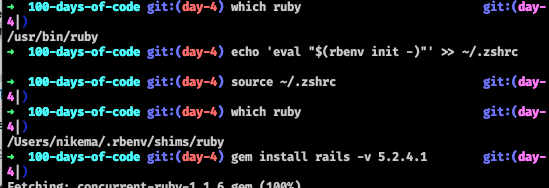
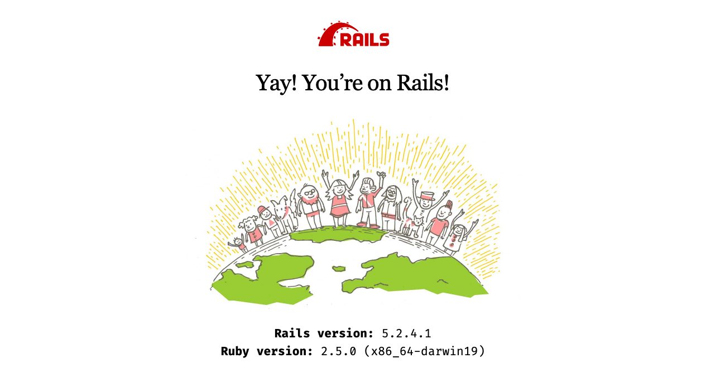

---
title: Day 4 
weight: 4
template: docs
-- 

I'm in the process of accepting contract work in a new language that will involve testing. This will probably change the goals of 100 Days of Code. I'm going to be looking into some free curriculum to get start preparing.

****
So I'm getting my computer set up for Rails and I had to adjust the instructions because I'm using zsh instead of bash.

I used rbenv to install ruby 2.5.0 but the pre-installed ruby is what was being used. When I tried to install rails I got a permission error.

`echo 'eval "$(rbenv init -)"' >> ~/.zshrc`

This line of code was needed because the tutorial I followed had me update `~/.bash_profile`

I was getting an error message when I tried to start the server after updating the right dot file. I think reinstalling rails fixed it. 

****

Links to work

Resources I used today
- https://hub.github.com/hub-gist.1.html

   Installing Rails 
   - https://progate.com/docs/ruby-env
   - https://progate.com/docs/rails-env

Social posts
- https://dev.to/nikema/nikema-s-100-days-of-code-day-3-33kl
- https://twitter.com/dev_nikema/status/1230332042375647233?s=20

****

 

