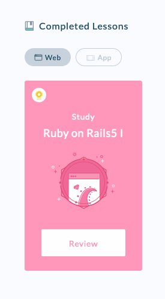
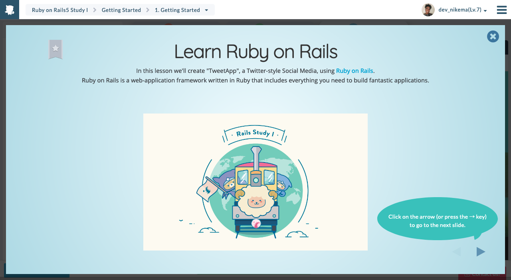

---
title: Day 5 
weight: 5
template: docs
-- 

Links to work

- https://tweet-app-prophen.herokuapp.com/
- https://github.com/prophen/tweet_app

Resources I used today
- https://www.linkedin.com/learning/installing-and-running-ruby-on-rails-5-mac/mysql?u=24867419

   Had a false start with this one. Trying to install mysql2 didn't work. I figured it was an old tutorial and I went back to progate where I found the tutorials for setting up my environment.

- https://progate.com/rails5/study/1/1#/0
   
   Finished the first lesson in the Ruby on Rails series.

- https://community.netlify.com/t/ruby-on-rails-app-does-not-work-on-netlify/982/3 

   Ruby on Rails doesn't work on Netlify 😃
- https://stackoverflow.com/questions/48264765/heroku-with-rails-5-error-gemloaderror-specified-postgresql-for-database-ad
- http://effectif.com/mac-os-x/installing-specific-version-of-homebrew-formula
- https://apple.stackexchange.com/questions/194280/how-to-restart-postgresql-installed-by-brew-in-osx
- https://devcenter.heroku.com/articles/sqlite3 

   Heroku doesn't use sqlite3 so I needed to change over to pg before I could deploy.
- https://github.com/ga-wdi-boston/capstone-project/issues/325 

   `tail /usr/local/var/log/postgres.log`
   I found out how to inspect the server log here. This was the key to finding the bug. I was using version 12 of postgres and I needed version 11.

Social posts
- https://twitter.com/dev_nikema/status/1230757477081214977?s=20
- https://dev.to/nikema/nikema-s-100-days-of-code-day-5-5bib

****

 

